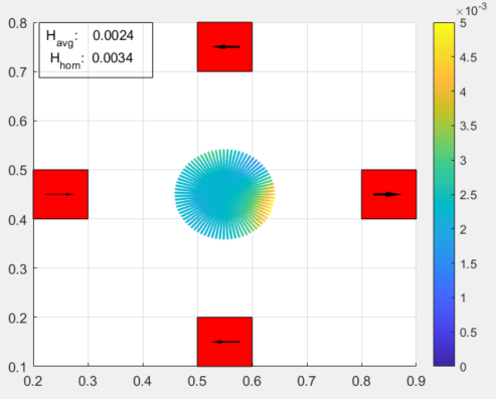

# Example_FourMagnets
Project for the first three months of PhD studies.   
Optimizing a fixed structure consisting of four permanent magnets on its field strength and homogeneity.  
Results should deliver a proof of concept.

## Structure of example

